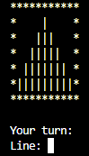
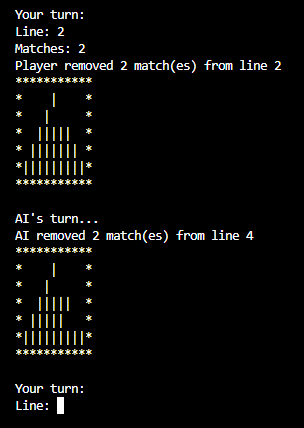

# matchstick_game_sh
Play the shell version of a matchstick game against an Artificial Intelligence, in your terminal

The goal is to make your oponent picking the last matchstick. 

Start the game by executing the binary 'matchstick' with two parameters.
The first parameter is the number of lines (of matchsticks) and the second one is the max number of stick that you can remove in one play.

```bash
./matchstick 5 3
```



You will always start the game.

You need to provide the line on which you want to remove matchsticks and the number of matchsticks you want to remove.
Then, the AI will play his turn.



Good luck !
